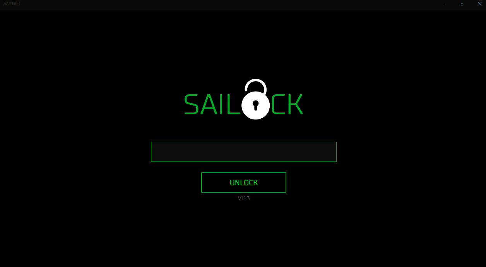
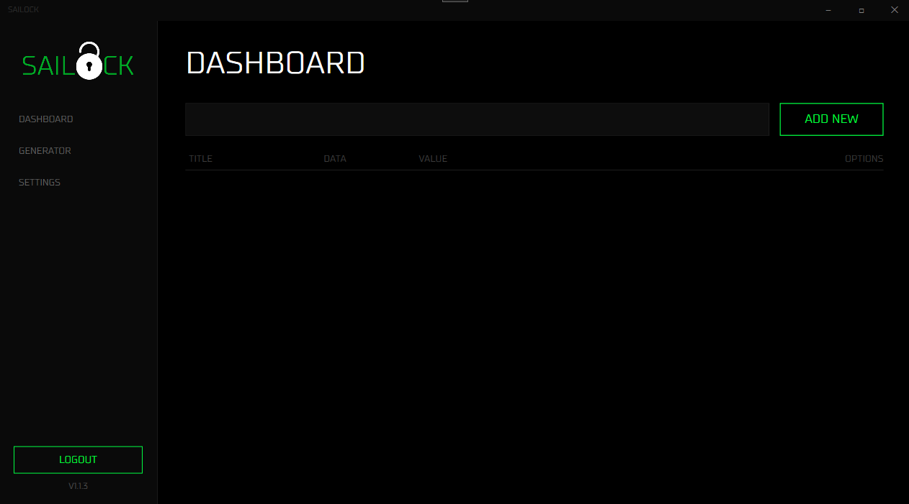
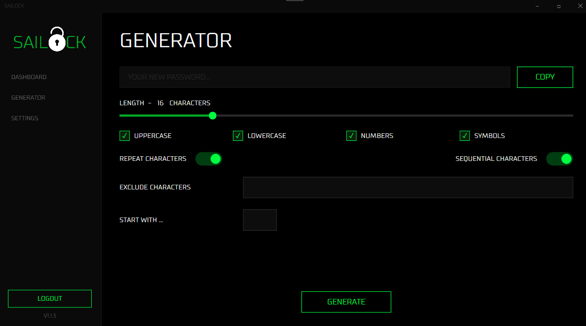
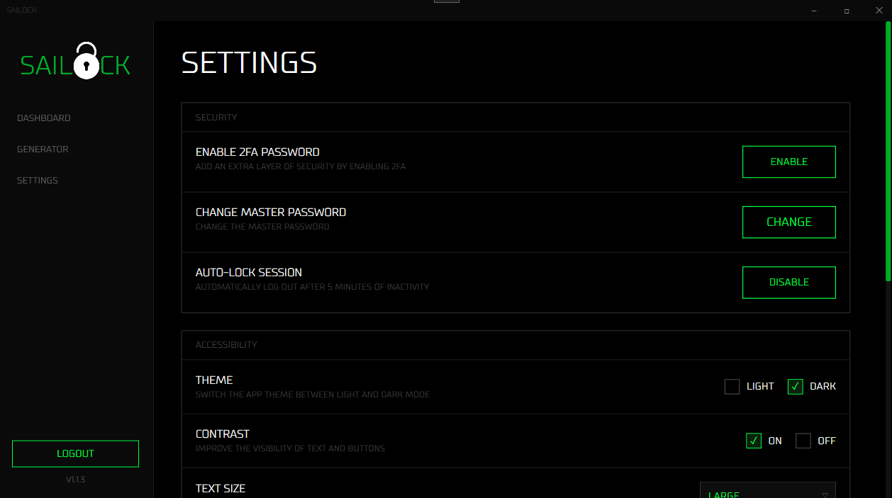
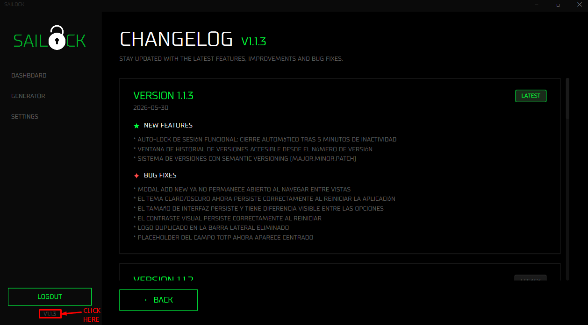

<div align="center">

  <h1>Sailock</h1>
  <p>A local-first password manager for Windows. No cloud, no internet — your data never leaves your device.</p>
</div>

<p align="center">
  
  
  
  
  
</p>

<p align="center">
  <a href="#-features">Features</a> ·
  <a href="#-screenshots">Screenshots</a> ·
  <a href="#-getting-started">Getting Started</a> ·
  <a href="#-security">Security</a> ·
  <a href="#-changelog">Changelog</a>
</p>

---

## ✦ Features

- **AES-256 encrypted** local storage using a custom `.slock` file format
- **Master password authentication** — key derived with PBKDF2 (100,000 iterations)
- **Two-factor authentication** via TOTP (compatible with Google Authenticator, Authy, and any standard TOTP app)
- **Auto-lock** after configurable inactivity period
- **Password generator** with adjustable length, charset, exclusions and prefix
- **Dark and light theme** with high contrast mode
- **Configurable interface scale** (Small, Default, Large)
- **Import / export** of encrypted `.slock` backups
- **Built-in changelog** accessible directly from within the app

---

## ✦ Screenshots

<p align="center">
  
  
</p>
<p align="center">
  
  
</p>
<p align="center">
  
</p>

---

## ✦ Tech Stack
| Layer | Technology |
|---|---|
| Language | C# 12 / .NET 8 |
| UI Framework | WPF (Windows only) |
| Architecture | MVVM |
| Encryption | AES-256 + PBKDF2 |
| 2FA | TOTP via [Otp.NET](https://github.com/kspearrin/Otp.NET) |
| QR Codes | [QRCoder](https://github.com/codebude/QRCoder) |
| Font | [JetBrains Mono](https://www.jetbrains.com/lp/mono/) |

---

## ✦ Project Structure
```
Sailock/
├── Helpers/         # RelayCommand, ViewModelBase, Converters, QR helper
├── Models/          # PasswordEntry, AppData, AppSettings, ChangelogEntry
├── Resources/       # Icons and logo assets
├── Services/        # Crypto, Storage, Navigation, Theme, TOTP, AutoLock, Changelog, Version
├── ViewModels/      # One ViewModel per screen
├── Views/           # XAML UserControls
└── Fonts/           # JetBrains Mono
```

---

## ✦ Getting Started
### Requirements

- Windows 10 or later (64-bit)
- [.NET 8 SDK](https://dotnet.microsoft.com/download/dotnet/8.0) *(only required for building from source)*

### Download
Head to the [**Releases**](https://github.com/Sailok25/Sailock/releases/latest) page and download the latest `.exe`. No installation required — it's a self-contained single file.

### Build from source
```bash
git clone https://github.com/Sailok25/Sailock.git
cd Sailock/Sailock
dotnet build
dotnet run
```

### First run
On first launch, Sailock will prompt you to create a master password. This password is used to derive the encryption key for your `.slock` data file.

> [!WARNING]
> There is no password recovery mechanism. **Do not forget your master password.**

---

## ✦ Security
| Property | Detail |
|---|---|
| Encryption | AES-256 (CBC) |
| Key derivation | PBKDF2, 100,000 iterations, random salt |
| IV | Randomly generated per save |
| Master password | Never stored — derived at runtime only |
| Network access | None — Sailock is fully offline |
| Data location | `%APPDATA%\Sailock\data.slock` |

Each save operation generates a new salt and IV, meaning no two encrypted files are identical even with identical data and the same password.

---

## ✦ Changelog
See [CHANGELOG.md](CHANGELOG.md) for the full version history.

---

## ✦ License
Copyright © 2025 Alba Ayala Vilanova. All rights reserved.

This project is source-available for reading and contribution purposes only.
Copying, reusing or distributing any part of this code without explicit written permission is not allowed.
See [LICENSE](LICENSE) for full terms.

---

## ✦ Author
Developed by **Alba Ayala Vilanova** — [GitHub @Sailok25](https://github.com/Sailok25)
